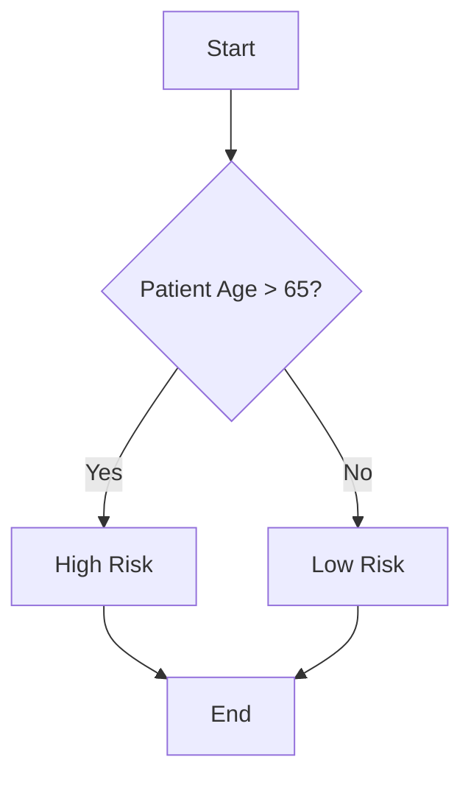
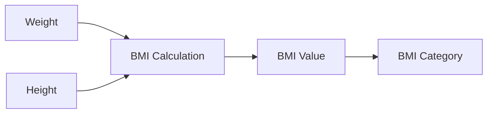

<!--
# Instructor Preparation Notes

This lecture covers three main topics for health data science students who are beginners in programming:
1. `Jupyter` notebooks as an interactive environment for health data exploration
2. Debugging techniques from basic to advanced for health-related Python code
3. Working with large health datasets using `polars`

## Time Allocation
- `Jupyter` notebooks: 20 minutes + 10 minute demo
- Debugging: 30 minutes + 20 minute demo (split between print, pdb and `VS Code`)
- Big Data: 20 minutes + 10 minute demo
- Total: 110 minutes (including demos)

## Demo Preparation
- Ensure all demo scripts are working on your machine
- For demo1: Have a simple script with common bugs ready (patient data processing)
- For demo2: Prepare a script with logical errors for pdb debugging (medication dosage calculation)
- For demo3: Have VS Code ready with the buggy_script.py loaded (BMI calculation)
- For demo4: Test generate_large_health_data.py and analyze_large_health_data.py (large patient dataset)

## Common Student Questions
- "Why use `Jupyter` instead of regular Python scripts?"
- "When should I use print vs. debugger?"
- "How do I know which debugging technique to use?"
- "What's the difference between `pandas` and `polars`?"
- "How large is 'too large' for `pandas`?"
- "How do I know if my code has a bug or if my data is wrong?"
- "Can I use these debugging techniques in other programming languages?"

## Key Learning Outcomes
- Students should be able to use `Jupyter` for interactive health data exploration
- Students should be able to identify and fix common bugs using appropriate techniques
- Students should understand when and how to use `polars` for large health datasets
- Students should be able to apply debugging skills to their own health data projects
-->

# Debugging and Big Data in Health Data Science 🐛💾🏥 [\[pdf\]](lecture_02.pdf)

> Debugging: Being the detective in a crime movie where you are also the murderer

## Lecture Outline

1. **`Jupyter` Notebooks for Health Data Exploration** (30 min)
   - What are `Jupyter` notebooks and why use them?
   - Magic commands and shell integration
   - Best practices for reproducible analysis
   - **Demo Break**: Interactive exploration of health data

2. **Debugging Python Code in Health Applications** (40 min)
   - Print debugging: The first line of defense
   - Interactive debugging with `pdb`
   - Visual debugging with `VS Code`
   - Common bugs in health data processing
   - **Demo Break**: Finding and fixing bugs in health data scripts

3. **Working with Large Health Datasets** (30 min)
   - Why traditional `pandas` might not be enough
   - Introduction to `polars` for efficient processing
   - Handling electronic health records larger than memory
   - Best practices for big health data
   - **Demo Break**: Analyzing a large patient dataset
<!--
# Expanded Speaking Notes: Lecture Outline

This lecture is designed to build foundational skills for health data science students who are new to programming. It covers three essential areas:

---

### 1. Jupyter Notebooks for Health Data Exploration

`Jupyter` notebooks are the primary tool for interactive coding, data analysis, and visualization in health data science. Students will learn **why notebooks are ideal for exploring patient data**, how to use built-in features like magic commands and shell integration, and best practices to ensure their analyses are **clear, reproducible, and shareable**. The goal is for students to feel comfortable running code, visualizing results, and documenting their work all in one place.

---

### 2. Debugging Python Code in Health Applications

Debugging is a critical skill for all programmers. Here, students will start with **simple print statements** to understand program flow and catch errors. We'll briefly introduce **interactive debugging with `pdb`** as a more advanced tool, mainly to show what's possible, but not expect mastery. Then, we'll explore **visual debugging in `VS Code`**, which provides a beginner-friendly way to pause and inspect code. Throughout, examples will focus on **common bugs in health data processing**, such as unit mismatches or missing data, so students can relate debugging to real-world problems.

---

### 3. Working with Large Health Datasets

Health data is often **too large to fit into memory**, which creates unique challenges. Students will learn **why traditional `pandas` may fail**, and how tools like **`polars`** and **`Parquet` file formats** enable efficient analysis of big data. The focus is on practical strategies to handle large datasets **without crashing their computers**, including filtering early, using efficient storage, and leveraging lazy evaluation.

---

### Demos

Each section includes a **hands-on demo** to reinforce concepts:
- Exploring data in Jupyter
- Debugging real scripts
- Analyzing large datasets with `polars`

These demos are designed to be **beginner-friendly** and build confidence in applying new skills.

---

### Overall Goal

By the end of this lecture, students should be able to:
- Use `Jupyter` notebooks effectively
- Debug simple Python scripts related to health data
- Understand basic strategies for working with large datasets

This foundation will support their future coursework and projects in health data science.

-->

## References and Resources 📚

### Python and Jupyter Resources

- [Jupyter Documentation](https://jupyter.org/documentation) - Official documentation for Jupyter notebooks
- [Dataquest Jupyter Tutorial](https://www.dataquest.io/blog/jupyter-notebook-tutorial/) - Beginner-friendly tutorial
- [Python for Healthcare Modelling and Data Science](https://www.routledge.com/Python-for-Healthcare-Modelling-and-Data-Science/Dauletbakov-Moussa/p/book/9781032124001) - Python applications in healthcare
- [Official Python Documentation](https://docs.python.org/3/) - Python language reference

### Debugging Resources

- [Python Debugger (pdb) Documentation](https://docs.python.org/3/library/pdb.html) - Official pdb documentation
- [`VS Code` Debugging Guide](https://code.visualstudio.com/docs/python/debugging) - Visual debugging tutorial
- [Real Python Debugging Guide](https://realpython.com/python-debugging-pdb/) - Practical debugging techniques
- [Python Testing with `pytest`](https://pragprog.com/titles/bopytest/python-testing-with-pytest/) - Testing as a debugging strategy

### Big Data Processing Resources
- [`pandas` Documentation](https://pandas.pydata.org/) - Standard data analysis library
- [`polars` Documentation](https://pola.rs/) - Fast DataFrame library for large datasets
- [Python for Data Analysis](https://wesmckinney.com/book/) - By `pandas` creator Wes McKinney
- [`Parquet` Format Explained](https://parquet.apache.org/docs/) - Efficient columnar storage format
- [Healthcare Data Analytics Using Python](https://link.springer.com/book/10.1007/978-1-4842-7986-7) - Specific to health data
- [Healthcare Data Analytics Using Python](https://link.springer.com/book/10.1007/978-1-4842-7986-7) - Specific to health data

## 1. Jupyter Notebooks for Health Data Exploration 🎮🏥

### 1.1 What Are Jupyter Notebooks?


Jupyter notebooks are interactive documents that let you **write and run code, see results immediately, and mix in text, images, and equations**.

```python
# Example of a code cell in Jupyter
import pandas as pd
patient_data = pd.read_csv("patient_records.csv")
patient_data.head()  # Displays first 5 rows
```

#### Why Jupyter is Perfect for Health Data Science:

- **Interactive exploration**: Test hypotheses on patient data instantly
- **Visual analysis**: Create charts of health metrics on the fly
- **Documentation**: Explain your analysis alongside code
- **Reproducibility**: Share complete analyses with colleagues
- **Teaching tool**: Perfect for learning data science concepts

<!--
**Concept:** Jupyter notebooks combine code execution, rich text, and visualizations in a single document.

**Reference:** Jupyter supports 40+ programming languages, but we'll focus on Python for health data science.

**Example:** A typical health data workflow in Jupyter might include:
1. Loading patient data
2. Cleaning and preprocessing
3. Exploratory visualization
4. Statistical analysis
5. Documenting findings with markdown

**Health Context:** Jupyter is widely used in health data science for:
- Analyzing electronic health records
- Visualizing disease trends
- Building predictive models for patient outcomes
- Sharing reproducible research

**Common Beginner Mistakes:**
- Running cells out of order, causing dependency errors
- Not saving notebooks frequently
- Forgetting to document assumptions and data sources
-->

### 1.2 Magic Commands ✨

Jupyter has special commands starting with `%` (line magics) or `%%` (cell magics) that extend functionality.

#### Essential Magic Commands:

| Magic Command | What It Does | Health Data Example |
|---------------|--------------|---------------------|
| `%pip install` | Install packages | `%pip install pydicom` for medical imaging |
| `%matplotlib inline` | Display plots in notebook | Visualize patient vitals over time |
| `%timeit` | Measure code performance | Optimize patient matching algorithms |
| `%debug` | Debug after an error | Fix issues in data cleaning pipeline |
| `%run` | Run external scripts | Execute preprocessing scripts |

```python
# Example: Timing a patient matching function
%timeit find_matching_patients(patients_df, "diabetes")
```

<!--
**Concept:** Magic commands provide special functionality beyond standard Python.

**Reference:** A complete list of magic commands is available via `%lsmagic` in Jupyter.

**Example:** When analyzing large health datasets, use `%%time` to measure cell execution time:
```python
%%time
# Process million-row patient dataset
result = process_large_ehr_dataset(patient_records)
```

**Health Context:** Magic commands are particularly useful for:
- Timing performance of patient matching algorithms
- Debugging data preprocessing pipelines
- Visualizing health metrics inline
- Installing specialized health data packages

**Tip:** The `%debug` magic is invaluable when your data cleaning pipeline encounters errors with patient records.
-->

### 1.3 Shell Commands in Jupyter 🖥️

You can run system commands by prefixing with `!`, perfect for managing health data files.

```python
# List all CSV files in the patient_data directory
!ls ./patient_data/*.csv

# Count lines in a large health dataset
!wc -l hospital_admissions.csv

# Check disk space for large imaging datasets
!du -h ./medical_images/
```

#### Common Shell Commands:

- `!head -n 5 patient_data.csv` - Preview first 5 lines of a dataset
- `!grep "diabetes" patient_records.txt` - Find records containing "diabetes"
- `!mkdir -p ./processed_data/2023` - Create directories for organized data
- `!wget https://data.gov/health/dataset.csv` - Download public health datasets

<!--
**Concept:** The `!` prefix allows running any shell command from within Jupyter.

**Reference:** These commands work on Linux/Mac; Windows users may need slight modifications.

**Example:** A common workflow for health data preprocessing:
```python
# Download dataset
!wget https://healthdata.gov/dataset.csv

# Check file size and preview
!du -h dataset.csv
!head -n 3 dataset.csv

# Basic preprocessing with shell tools
!grep "COVID-19" dataset.csv | wc -l  # Count COVID-19 records
```

**Health Context:** Shell commands are particularly useful for:
- Managing large collections of patient files
- Performing quick counts and filters on health records
- Downloading public health datasets
- Checking file integrity of medical images

**Warning:** Be careful with destructive commands like `rm` that could delete valuable health data.
-->

<!--
**Best Practices:**
- Use Markdown cells for explanations.
- Restart and run all before sharing.
- Export notebooks for reports.

**Common Mistake:** Not rerunning all cells, leading to inconsistent state.

**Demo Break:**
- Students try `%pip`, `%timeit`, and `!ls`.
- Add Markdown explanations.

- Prefixing with `!` lets you run shell commands inside Jupyter, just like in a terminal.
- Useful for checking files, running scripts, or managing data without leaving the notebook.
-->

### 1.4 Best Practices for Reproducible Research 📊


#### Key Practices:

1. **Organize your notebook:**
   - Use markdown headings to structure analysis
   - Include study objectives and methods
   - Document data sources and limitations

2. **Ensure reproducibility:**
   - Set random seeds for consistent results
   - Use relative file paths
   - Include package versions with `!pip freeze`
   - Restart and run all cells before sharing

3. **Data documentation:**
   - Include data dictionaries for health variables
   - Document preprocessing steps
   - Note missing data handling
   - Include ethical considerations

4. **Export for sharing:**
   - HTML/PDF for reports to clinicians
   - `.py` scripts for production pipelines
   - GitHub for version control
   - Binder for interactive sharing

```python
# Example: Setting random seed for reproducible patient sampling
import numpy as np
np.random.seed(42)  # Always use the same random sample
patient_sample = patient_data.sample(n=100)
```

<!--
**Concept:** Reproducibility is especially critical in health research where findings may impact clinical practice.

**Reference:** The FAIR principles (Findable, Accessible, Interoperable, Reusable) should guide health data science.

**Example:** A well-structured health data notebook should include:
```markdown
# Diabetes Readmission Analysis
## Data Source
Hospital admissions from 2018-2022, n=15,432 patients
## Methods
Logistic regression with 5-fold cross-validation
## Limitations
Missing HbA1c values (15% of records)
```

**Health Context:** Reproducibility challenges specific to health data:
- Protected health information (PHI) limitations
- Data versioning as medical records update
- Institutional differences in coding practices
- Regulatory compliance requirements

**Demo Break:** At this point, have students open the provided notebook with sample health data and try:
1. Running cells with magic commands
2. Using shell commands to explore data files
3. Adding markdown documentation
4. Setting up a reproducible analysis workflow
-->

### DEMO BREAK: Interactive Exploration of Health Data
See: [`demo0-jupyter-notebooks.md`](./demo/demo0-jupyter-notebooks.md)

## 2. Debugging Python Code 🐛🏥

<!--
# Expanded Speaking Notes: Debugging Python Code

---

### What is Debugging?

Debugging is the process of **finding and fixing mistakes (bugs)** in your code. It's a core skill for every programmer. Bugs can cause wrong results, crashes, or subtle errors in analysis.

---

### Why Debugging Matters in Health Data Science

- Health data is **complex and messy**, making bugs common.
- Mistakes can lead to **incorrect clinical insights** or flawed research.
- Debugging helps ensure **accuracy, reliability, and trustworthiness** of your analyses.

---

### Common Bugs in Health Data Code


- **Unit mismatches:** pounds vs kilograms, mg vs g.
- **Missing data:** empty fields causing errors.
- **Date/time issues:** wrong formats or time zones.
- **Logic errors:** filtering the wrong patients.
- **Typos:** misspelled variable names.

---

### Debugging Techniques Overview


- **Print debugging:** Add print statements to check values and flow.
- **pdb:** Pause and inspect code interactively (advanced, brief intro only).
- **VS Code Debugger:** Visual, beginner-friendly way to pause and inspect.
- **Version control (git):** Track changes, revert mistakes, and compare versions to identify when bugs were introduced.

---

### Visual Suggestions

- Screenshot of VS Code with a **breakpoint set** (#FIXME)
- Screenshot of **variable inspection panel** in VS Code (#FIXME)
- Code block showing **pdb session** with commands and output (already included, sufficient)
- xkcd comic about debugging or code mistakes (#FIXME)

---

### Humor / Engagement


- "Debugging: The art of removing the needles from the haystack you just created."
- "To err is human, to debug divine." 😄
- Insert xkcd comic (#FIXME)

---

### Teaching Focus

- Emphasize **print debugging** and **VS Code** as beginner-friendly.
- Present **pdb** as an optional, more advanced tool with a quick demo and links for further learning.
- Encourage students to **use version control** to track and undo changes.
- Highlight that **everyone writes bugs**—debugging is a normal, essential part of coding.

-->

### 2.1 Print Debugging: Your First Line of Defense

```python
def calculate_bmi(weight, height):
    print(f"Weight: {weight} kg")    # Debug print
    print(f"Height: {height} m")     # Debug print
    bmi = weight / (height ** 2)
    print(f"BMI: {bmi}")             # Debug print
    return bmi

# Output:
# Weight: 70 kg
# Height: 1.75 m
# BMI: 22.86
```

The **simplest** debugging technique is adding strategic print statements to track values and program flow.

```python
def calculate_bmi(weight_kg, height_m):
    print(f"Input: weight={weight_kg}kg, height={height_m}m")  # Debug print
    
    bmi = weight_kg / (height_m ** 2)
    print(f"Calculated BMI: {bmi}")  # Debug print
    
    if bmi < 18.5:
        category = "Underweight"
    elif bmi < 25:
        category = "Normal weight"
    elif bmi < 30:
        category = "Overweight"
    else:
        category = "Obese"
    
    print(f"BMI Category: {category}")  # Debug print
    return bmi, category
```

#### When to Use Print Debugging:

- **Quick checks** during development
- **Understanding data flow** in health record processing
- **Identifying where** a function fails with patient data
- **Tracking values** of clinical variables through calculations

#### Print Debugging Patterns:

```python
# 1. Checkpoint prints
print("Starting patient data import...")

# 2. Variable inspection
print(f"Patient ID: {patient_id}, Type: {type(patient_id)}")

# 3. Data shape checks
print(f"Patient dataframe shape: {df.shape}")

# 4. Conditional debugging
if blood_pressure > 180:
    print(f"WARNING: Very high BP value: {blood_pressure}")
```

<!--
**Concept:** Print debugging is inserting strategic print statements to observe program state and flow.

**Reference:** While simple, print debugging remains the most commonly used technique by developers at all levels.

**Example:** When debugging a patient risk score calculation:
```python
def calculate_risk_score(age, bp_systolic, diabetes):
    print(f"Inputs: age={age}, bp={bp_systolic}, diabetes={diabetes}")
    
    # Base risk from age
    risk = age / 10
    print(f"Age risk component: {risk}")
    
    # Add BP component
    bp_risk = (bp_systolic - 120) / 10 if bp_systolic > 120 else 0
    print(f"BP risk component: {bp_risk}")
    
    # Add diabetes component
    if diabetes:
        diabetes_risk = 10
        print("Adding diabetes risk: 10")
    else:
        diabetes_risk = 0
        print("No diabetes risk")
    
    total_risk = risk + bp_risk + diabetes_risk
    print(f"Total risk score: {total_risk}")
    return total_risk
```

**Health Context:** Common bugs in health data processing:
- Unit conversion errors (pounds vs kg, cm vs inches)
- Missing value handling in patient records
- Edge cases with extreme lab values
- Date format inconsistencies in medical records

**Tip:** For production code, use a proper logging system instead of print statements.
-->

### 2.2 Interactive Debugging with Python Debugger (pdb) 🐞

```
> /path/to/script.py(10)calculate_bmi()
-> bmi = weight / (height ** 2)
(Pdb) p weight
70
(Pdb) p height
1.75
(Pdb) n
> /path/to/script.py(11)calculate_bmi()
-> print(f"BMI: {bmi}")
(Pdb) p bmi
22.86
(Pdb) c
```

Python's built-in debugger (`pdb`) allows you to **pause execution** and interactively explore program state.

#### How to Use pdb:

1. **Insert a breakpoint** in your code:
   ```python
   def process_lab_results(patient_labs):
       # Stop execution when this line is reached
       breakpoint()  # Python 3.7+ syntax
       # Or use: import pdb; pdb.set_trace()  # older Python versions
       
       abnormal_results = []
       for test, value in patient_labs.items():
           if is_abnormal(test, value):
               abnormal_results.append((test, value))
       return abnormal_results
   ```

2. **Run your script** normally - it will pause at the breakpoint

3. **Use pdb commands** to inspect and control execution:

*For more pdb commands and examples, see the [official Python pdb documentation](https://docs.python.org/3/library/pdb.html).*

pdb is a powerful tool, but for beginners, **print statements and VS Code's visual debugger** are usually easier to start with.
> /path/to/script.py(6)process_lab_results()
-> for test, value in patient_labs.items():
(Pdb) n
> /path/to/script.py(7)process_lab_results()
-> if is_abnormal(test, value):
(Pdb) p test, value
('glucose', 180)
(Pdb) s
--Call--
> /path/to/script.py(15)is_abnormal()
-> def is_abnormal(test, value):
```

<!--
**Concept:** Interactive debugging allows you to pause execution and examine the program state at any point.

**Reference:** The Python Debugger (pdb) is part of the standard library and requires no installation.

**Example:** When debugging a complex patient classification algorithm:
```python
def classify_patient_risk(patient):
    breakpoint()  # Pause here to inspect patient data
    
    # Calculate various risk factors
    age_risk = calculate_age_risk(patient['age'])
    bp_risk = calculate_bp_risk(patient['systolic'], patient['diastolic'])
    lab_risk = calculate_lab_risk(patient['labs'])
    
    # Combine risk factors
    total_risk = age_risk + bp_risk + lab_risk
    
    # Classify patient
    if total_risk > 20:
        return "High Risk"
    elif total_risk > 10:
        return "Medium Risk"
    else:
        return "Low Risk"
```

**Health Context:** pdb is particularly useful for:
- Debugging complex patient classification algorithms
- Tracing data transformations in health record processing
- Understanding how clinical decision support systems work
- Finding bugs in biostatistical calculations

**Tip:** Use `breakpoint(condition)` to only pause when certain conditions are met, like when processing a specific patient ID or when encountering unusual lab values.
-->
-> bmi = weight / (height ** 2)
(Pdb) p weight
70
(Pdb) p height
1.75
(Pdb) n
-> return bmi
(Pdb) p bmi
22.86
(Pdb) c
```

### 2.3 Visual Debugging with VS Code 🖥️


VS Code provides a **graphical debugger** that makes debugging more intuitive and powerful.

#### Key VS Code Debugging Features:

1. **Visual breakpoints**: Click in the gutter to set breakpoints
2. **Variable explorer**: See all variables and their values
3. **Watch expressions**: Monitor specific expressions
4. **Call stack view**: See the execution path
5. **Step controls**: Buttons for step over, into, out
6. **Conditional breakpoints**: Break only when a condition is true

#### Setting Up VS Code for Debugging:

1. Install the Python extension
2. Open your health data script
3. Set breakpoints by clicking left of line numbers
4. Press F5 or click the "Run and Debug" button


5. Select "Python File" configuration

#### Debugging a Patient Data Processing Script:


```python
def calculate_medication_dosage(patient_weight, medication):
    """Calculate medication dosage based on patient weight."""
    # Set a breakpoint on this line
    if medication == "acetaminophen":
        return patient_weight * 15  # 15mg per kg
    elif medication == "ibuprofen":
        return patient_weight * 10  # 10mg per kg
    else:
        return 0  # Unknown medication
```

#### Advanced VS Code Debugging Features:

- **Conditional breakpoints**: Break only when `patient_id == "P12345"`
- **Logpoints**: Log values without modifying code
- **Data visualizations**: Plot patient data while debugging
- **Remote debugging**: Debug code running on hospital servers

<!--
**Concept:** Visual debugging provides a more intuitive interface for tracking program execution and state.

**Reference:** VS Code is free, open-source, and available for Windows, Mac, and Linux.

**Example:** When debugging a patient cohort selection algorithm:
1. Set breakpoints at key decision points
2. Use the Variables panel to inspect patient records
3. Add Watch expressions for complex conditions like `patient['age'] > 65 and 'diabetes' in patient['conditions']`
4. Use the Call Stack to understand how you arrived at the current point
5. Use conditional breakpoints to pause only for specific patient types

**Health Context:** VS Code debugging is particularly valuable for:
- Complex health data pipelines with multiple processing steps
- Machine learning model development for clinical prediction
- Collaborative debugging of health analytics code
- Identifying data quality issues in large patient datasets

**Tip:** Create a launch.json configuration specifically for your health data projects with common settings and paths.
-->

### DEMO BREAK: Finding and Fixing Bugs in Health Data Scripts
See: [`demo1-print-debugging.md`](./demo/demo1-print-debugging.md), [`demo2-pdb-debugging.md`](./demo/demo2-pdb-debugging.md), and [`demo3-vscode-debugging.md`](./demo/demo3-vscode-debugging.md)

These demos will reinforce the debugging concepts covered in the lecture and prepare you for the assignment where you'll debug real data processing scripts.


### 2.4 Control Flow vs Data Flow

### Control Flow

- The **order** in which code runs
- Controlled by `if`, `for`, `while`, function calls
- Visualized as a **flowchart**



### Data Flow

- How **data moves** through variables and functions
- Tracks **where values come from and go**
- Helps find **where bad data originates**



### 2.6 Using Test Cases to Reproduce Bugs

- Create **small, repeatable examples** that trigger the bug
- Automate with `assert` statements or test frameworks
- Ensures bug is fixed and **doesn't come back**

#### Simple Test Cases

```python
def test_bmi():
    assert calculate_bmi(70, 1.75) > 0
```

#### Using pytest for Automated Testing

[`pytest`](https://docs.pytest.org/) is a popular testing framework that makes it easy to write and run tests.

1. **Installation**:
   ```bash
   pip install pytest
   ```

2. **Creating Test Files**:
   - Name files with `test_` prefix (e.g., `test_bmi_calculator.py`)
   - Write functions with `test_` prefix

3. **Writing Tests**:
   ```python
   # test_bmi_calculator.py
   def test_bmi_calculation():
       from bmi_calculator import calculate_bmi
       assert calculate_bmi(70, 1.75) == 22.86
       
   def test_bmi_categories():
       from bmi_calculator import get_bmi_category
       assert get_bmi_category(18.4) == "Underweight"
       assert get_bmi_category(22.0) == "Normal weight"
       assert get_bmi_category(27.5) == "Overweight"
       assert get_bmi_category(31.0) == "Obese"
   ```

5. **Benefits for Debugging**:
   - Verify fixes work correctly
   - Prevent regression (bugs coming back)
   - Document expected behavior
   - Automate testing with GitHub Actions

<!--
**Concept:** Automated testing helps verify that your code works as expected and stays working.

**Reference:** pytest documentation: https://docs.pytest.org/

**Example:** When fixing bugs in health data processing, tests ensure that:
- Fixed bugs don't return in future changes
- Edge cases are properly handled
- Functions return expected values for known inputs

**Tip:** Write tests for bugs you find to prevent them from recurring. This is called "regression testing."
-->

## 3. Working with Large Datasets 💾🏥


<!--
# Expanded Speaking Notes: Big Data in Health Data Science

---

### Why Big Data Matters

Modern health data includes **millions of patient records, genomic sequences, imaging files, and real-time monitoring data**. This data can improve patient care, track disease outbreaks, and support research. However, its sheer size creates challenges for analysis on typical laptops.

---

### Key Challenges

- **Memory limits:** Many datasets won't fit into RAM, causing crashes or slowdowns.
- **Data complexity:** Multiple sources, formats, and missing values.
- **Privacy concerns:** Large datasets often contain sensitive information.
- **Performance:** Standard tools like pandas may be too slow or fail entirely.

---

### Common Health Data Issues

- **Missing or inconsistent data:** e.g., different units, typos, or empty fields.
- **Extreme values:** Outliers in lab results or vital signs.
- **Date/time problems:** Time zones, formats, or missing timestamps.
- **Protected Health Information (PHI):** Must be handled carefully, even during debugging.

---

### Conceptual Foundations

- **Out-of-core processing:** Analyzing data **without loading it all into memory**.
- **Columnar storage (Parquet):** Stores data by column, making queries faster and files smaller.
- **Lazy evaluation:** Defers computation until needed, optimizing performance.
- **Streaming:** Processes data in chunks, enabling work on datasets larger than memory.

---

### Tools and Techniques

- **polars:** A fast DataFrame library designed for big data, supporting lazy and streaming operations.
- **Parquet:** A compressed, columnar file format ideal for large datasets.
- **Early filtering:** Reduce data size before loading or processing.
- **Selecting columns:** Only load what you need.

---

### Visual Suggestions

- Diagram of a **tiny laptop** next to a **huge database** with a red "MemoryError" sign (#FIXME replace with actual image)
- Screenshot of a **file size comparison**: CSV vs Parquet (#FIXME)
- Chart showing **speedup of polars vs pandas** (#FIXME)

---

### Humor / Engagement

- Insert an xkcd comic about big data or data problems (#FIXME)

---

### Key Takeaways

- Big data requires **different tools and strategies** than small datasets.
- Using **polars** and **Parquet** can make analysis feasible and efficient.
- Always consider **privacy and data quality** when working with health data.
- Start small: filter and select before processing everything.

-->

### 3.1 Why Traditional `pandas` Might Not Be Enough 🐼


Health data science often involves **massive datasets** that won't fit in memory:

📊 **Dataset Size Comparison**:
| Data Type | Typical Size | Fits in Memory? |
|-----------|--------------|-----------------|
| **Electronic Health Records (EHRs)** | 10GB-1TB+ | ❌ Often too large |
| **Medical Imaging** | 100MB-10GB per scan | ❌ Collections too large |
| **Genomic Data** | 1TB+ per patient | ❌ Far too large |
| **Claims Data** | 100GB+ | ❌ Too large |
| **Longitudinal Studies** | Growing over time | ❌ Eventually too large |
| **Small Research Dataset** | <1GB | ✅ Usually fits |

⚠️ **Memory Warning Signs**:
- Computer slows down dramatically
- Applications crash unexpectedly
- "MemoryError" in Python
- System becomes unresponsive

#### The `pandas` Memory Challenge:

```python
# This approach works for small datasets but fails with large ones
import pandas as pd

try:
    # 🚨 Will crash with large health datasets
    patient_records = pd.read_csv("hospital_records_2020_2023.csv")
    diabetes_patients = patient_records[patient_records["diagnosis"] == "diabetes"]
except MemoryError:
    print("Dataset too large for memory!")
```

### 3.2 Introduction to polars for Efficient Data Processing ⚡


**polars** is a modern DataFrame library designed for speed and efficiency:

🚀 **Key Features**:
| Feature | Description | Benefit |
|---------|-------------|---------|
| **Lazy Evaluation** | Plans operations before execution | Optimizes query plan |
| **Streaming** | Processes data in chunks | Handles data larger than memory |
| **Arrow Backend** | Efficient columnar memory layout | Faster data processing |
| **Parallel Processing** | Uses all CPU cores | Better performance |
| **Similar Syntax** | Familiar API for pandas users | Easy transition |

📈 **Performance Comparison**:
- **10-20x** faster than pandas for many operations
- Uses **50-80%** less memory for the same datasets
- Scales to datasets **100x larger** than pandas can handle

```python
import polars as pl

# Efficient processing of large health records
diabetes_stats = (
    pl.scan_csv("hospital_records_2020_2023.csv")  # Lazy loading
    .filter(pl.col("diagnosis") == "diabetes")     # Filter first
    .groupby(["age_group", "gender"])              # Group by demographics
    .agg([
        pl.count().alias("patient_count"),
        pl.mean("hba1c").alias("avg_hba1c"),
        pl.mean("bmi").alias("avg_bmi")
    ])
    .collect(streaming=True)  # Process in chunks
)
```

### 3.3 Parquet: An Efficient Data Storage Format for Out-of-Memory Scenarios 🗄️


**Parquet** is a columnar storage format that's essential for working with datasets larger than memory:

📁 **Storage Efficiency**:
| Format | Size | Query Speed | Schema | Best For |
|--------|------|-------------|--------|----------|
| **CSV** | 🔴 Large | 🔴 Slow | ❌ No | Simple data exchange |
| **JSON** | 🔴 Very large | 🔴 Very slow | ✅ Yes | API responses |
| **Parquet** | 🟢 Small (2-4x smaller) | 🟢 Fast | ✅ Yes | Analytics, big data |
| **HDF5** | 🟢 Small | 🟢 Fast | ✅ Yes | Scientific computing |

🔍 **Key Advantages**:
- **Column-based**: Perfect for analytical queries on specific variables
- **Compression**: 2-4x smaller than CSV files
- **Schema Enforcement**: Ensures data consistency
- **Predicate Pushdown**: Filter data before loading
- **Partitioning**: Organize by year, facility, or department


#### Comparing `pandas` vs `polars` with `Parquet`:

```python
import polars as pl
import pandas as pd
import time
import os

# Convert CSV to Parquet for more efficient storage
print("Converting CSV to Parquet...")
pl.read_csv("patient_vitals.csv").write_parquet("patient_vitals.parquet")

# Compare file sizes
csv_size = os.path.getsize("patient_vitals.csv") / (1024 * 1024)  # MB
parquet_size = os.path.getsize("patient_vitals.parquet") / (1024 * 1024)  # MB
print(f"CSV size: {csv_size:.2f} MB, Parquet size: {parquet_size:.2f} MB")
print(f"Compression ratio: {csv_size/parquet_size:.2f}x")

# Try with pandas - CSV (may fail with large files)
print("\nTrying pandas with CSV...")
try:
    start = time.time()
    df_pandas_csv = pd.read_csv("patient_vitals.csv")
    df_pandas_csv = df_pandas_csv[df_pandas_csv["timestamp"] > "2023-01-01"]
    print(f"Pandas CSV success: {len(df_pandas_csv)} rows in {time.time() - start:.2f}s")
except Exception as e:
    print(f"Pandas CSV failed: {str(e)}")

# Try with pandas - Parquet (usually works better)
print("\nTrying pandas with Parquet...")
try:
    start = time.time()
    df_pandas_parquet = pd.read_parquet("patient_vitals.parquet")
    df_pandas_parquet = df_pandas_parquet[df_pandas_parquet["timestamp"] > "2023-01-01"]
    print(f"Pandas Parquet success: {len(df_pandas_parquet)} rows in {time.time() - start:.2f}s")
except Exception as e:
    print(f"Pandas Parquet failed: {str(e)}")

# Try with polars - both work efficiently
print("\nTrying polars with CSV and Parquet...")
start = time.time()
df_polars_csv = pl.scan_csv("patient_vitals.csv").filter(pl.col("timestamp") > "2023-01-01").collect()
print(f"Polars CSV: {df_polars_csv.shape[0]} rows in {time.time() - start:.2f}s")

start = time.time()
df_polars_parquet = pl.scan_parquet("patient_vitals.parquet").filter(pl.col("timestamp") > "2023-01-01").collect()
print(f"Polars Parquet: {df_polars_parquet.shape[0]} rows in {time.time() - start:.2f}s")
```

#### Example Output:

```
Converting CSV to Parquet...
CSV size: 1024.50 MB, Parquet size: 256.30 MB
Compression ratio: 4.00x

Trying pandas with CSV...
Pandas CSV failed: MemoryError

Trying pandas with Parquet...
Pandas Parquet success: 1250000 rows in 8.45s

Trying polars with CSV and Parquet...
Polars CSV: 1250000 rows in 3.21s
Polars Parquet: 1250000 rows in 0.87s
```

<!--
**Concept:** Columnar storage formats like Parquet organize data by column rather than by row, making them ideal for analytical queries common in health data science.

**Reference:** The Apache Parquet project (https://parquet.apache.org/) provides detailed documentation.

**Example:** A hospital system might partition their EHR data by year and department:
```
hospital_data/
  year=2021/
    department=cardiology/data.parquet
    department=oncology/data.parquet
  year=2022/
    department=cardiology/data.parquet
    department=oncology/data.parquet
```

**Health Context:** Parquet is particularly valuable for health data because:
- Patient records often have many columns but queries focus on few
- Regulatory requirements may need data retention for years
- Research queries often filter by specific conditions or demographics
- Data sharing between institutions benefits from standardized formats

**Tip:** Always include a data dictionary alongside your Parquet files to document the meaning of each column, valid ranges, and units of measurement.
-->
### 3.4 Handling Datasets Larger Than Memory 📊

#### Common Challenges with Large Datasets:

1. **Memory Limitations**: Standard laptops have 8-16GB RAM
2. **Processing Time**: Full dataset scans can take hours
3. **Data Quality**: Missing values, inconsistent formats
4. **Joining Tables**: Patient data spread across multiple files
5. **Temporal Analysis**: Tracking changes over time

#### Strategies for Working with Large Data:

1. **Filter Early**: Apply filters before loading data
   ```python
   # Good: Filter during loading
   patients = pl.scan_csv("patients.csv").filter(pl.col("age") > 65).collect()
   
   # Bad: Load everything then filter
   patients = pl.read_csv("patients.csv")
   elderly = patients.filter(pl.col("age") > 65)
   ```

2. **Select Only Needed Columns**:
   ```python
   # Only load columns you need
   vitals = pl.scan_csv("vitals.csv").select(["patient_id", "heart_rate", "blood_pressure"])
   ```

3. **Use Lazy Evaluation**:
   ```python
   # Build up operations without executing
   query = (
       pl.scan_csv("lab_results.csv")
       .filter(pl.col("test_name") == "HbA1c")
       .join(pl.scan_csv("patients.csv"), on="patient_id")
       .groupby("age_group")
       .agg(pl.mean("result_value"))
   )
   
   # Execute only when needed
   result = query.collect(streaming=True)
   ```

### 3.5 Best Practices for Big Data

1. **Document Your Data Pipeline**:
   - Source of each dataset
   - Preprocessing steps
   - Filtering criteria
   - Expected output

2. **Validate Results on Subsets**:
   - Test on small samples first
   - Compare with known statistics
   - Check for outliers and anomalies

3. **Optimize Storage Format**:
   - Convert CSV to Parquet
   - Partition by logical divisions (year, facility)
   - Use compression appropriate for your data

4. **Monitor Resource Usage**:
   - Track memory consumption
   - Measure processing time
   - Identify bottlenecks

5. **Consider Privacy and Security**:
   - De-identify data when possible
   - Limit access to sensitive fields
   - Document compliance with regulations (HIPAA, GDPR)

<!--
**Concept:** Working with large health datasets requires a combination of technical strategies and domain knowledge.

**Reference:** The polars documentation (https://pola.rs/) provides detailed examples of lazy evaluation and streaming.

**Example:** A typical EHR analysis workflow might look like:
1. Convert raw data to Parquet format (one-time operation)
2. Build a lazy query plan that filters, joins, and aggregates
3. Execute with streaming to generate summary statistics
4. Save results to a smaller, analysis-ready dataset

**Health Context:** Large-scale health data analysis enables:
- Population health management
- Disease surveillance
- Health services research
- Clinical quality improvement
- Comparative effectiveness research

**Warning:** Always validate your results when working with large datasets. It's easy to introduce subtle bugs when optimizing for performance.
-->

### 3.6 Practical Applications

These techniques can be used to analyze:

- **Clinical Outcomes**: Mortality rates, readmissions, complications
- **Population Health**: Disease prevalence, geographic patterns
- **Healthcare Utilization**: ER visits, hospital stays, procedures
- **Quality Metrics**: Care compliance, preventive screening rates
- **Cost Analysis**: Resource utilization, intervention effectiveness

#### Real-world Example: Analyzing Hospitalization Data

```python
import polars as pl

# Process nationwide COVID-19 hospitalization data (hypothetical)
covid_stats = (
    pl.scan_parquet("covid_hospitalizations/*.parquet")
    .filter(
        (pl.col("admission_date") >= "2020-03-01") &
        (pl.col("admission_date") <= "2022-12-31")
    )
    .with_column(
        pl.col("admission_date").dt.month().alias("month"),
        pl.col("admission_date").dt.year().alias("year")
    )
    .groupby(["year", "month", "state", "age_group"])
    .agg([
        pl.count().alias("hospitalizations"),
        pl.mean("length_of_stay").alias("avg_stay_days"),
        pl.sum("icu_days").alias("total_icu_days"),
        pl.mean("o2_saturation").alias("avg_o2")
    ])
    .sort(["year", "month", "state"])
    .collect(streaming=True)
)

# Save results to a much smaller analysis file
covid_stats.write_parquet("covid_monthly_by_state_age.parquet")
```

### DEMO BREAK: Analyzing a Large Patient Dataset
See: [`demo4-bigdata.md`](./demo/demo4-bigdata.md)

